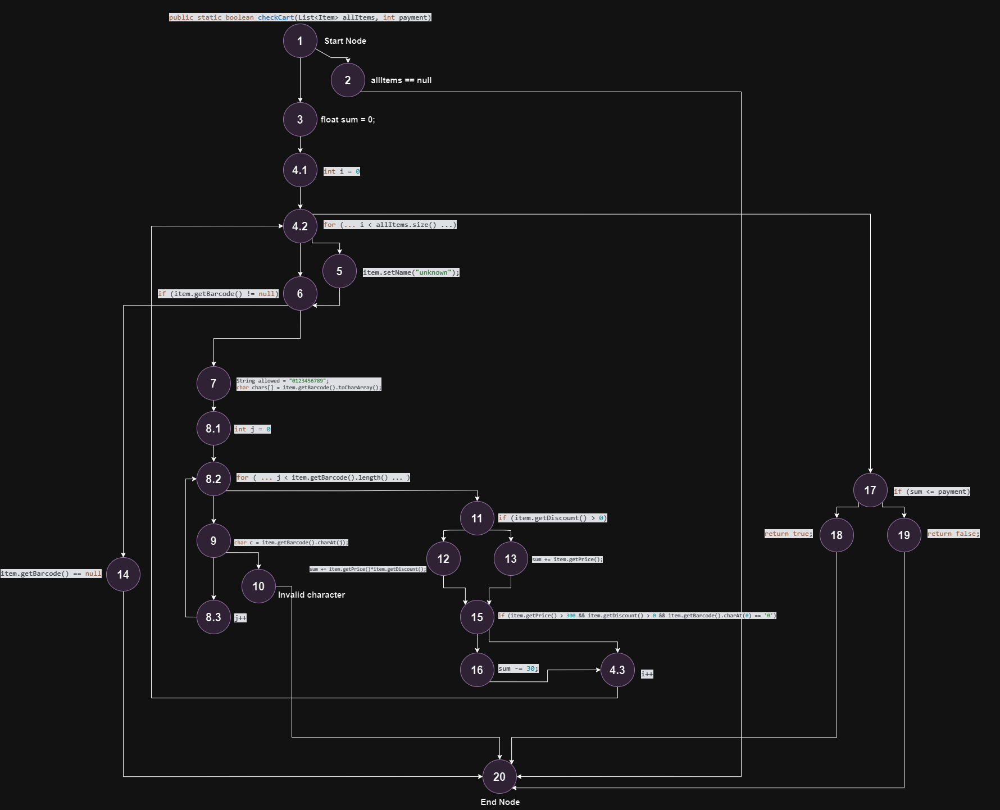

# Лабораториска вежба бр.2 Софтверско Инженерство
## Давор Младеновски 226042

Одговорите на прашањата се поставени подолу!

## Control Flow Graph



## Цикломатска комплексност

Цикломатската комплексност може да се пресмета по формулата:

Нека М означува цикломатска комплексност, па:

**М = E - N + 2P** каде:

- E - број ребра во графот
- N - број темиња во графот
- P - број на различни компоненти 

,според горе прикажаниот граф имаме **24 темиња**, **32 ребра** и **1 компонента ( сите темиња се поврзани со ребра )**,па од тука:

**М = 32 - 24 + 2** што ни дава дека цикломатската комплексност на функцијата **checkCart** е **10**

## Тест случаи според критериумот Every statement
|     |Влезни аргументи |Влезни аргументи|Влезни аргументи|Влезни аргументи|Влезни Аргументи|
|:---:|:---:      |  :---:                | :---: | :---:| :---: |
|Јазли|allItems = null, payment = {-infinity,+infinity}    | allItems = (new Item(null, "12345", 50, 0.1),new Item("", "67890", 100, 0.0)), payment = 100 |allItems = (new Item(Item1, null, 50, 0.1)), payment = 100 |allItems = ( new Item("Item1", "123A45", 50, 0.1),new Item("Item2", "67890", 100, 0.0)), payment = 100 | allItems = (new Item("Item1", "012345", 400, 0.1),new Item("Item2", "12345", 200, 0.1)), payment = 1000|
|1|*|*|  *  |*|* |
|2|*||      ||  |
|3||*|    *  |*|*    |
|4.1||*|   * |*| *   |
|4.2||*|    *|*|  *  |
|4.3|||     ||     * |
|5||*|      ||  |
|6||*|      *|*|*    |
|7||*|      |*| *|
|8.1||*|    |*| *|
|8.2||*|    |*| *|
|8.3||*|    |*| *|
|9||*|      |*| *|
|10|||      |*| |
|11||*|     ||  *|
|12||*|     ||  *|
|13||*|     ||  |
|14|||      *|| |
|15||*|     ||  *|
|16|||      ||  *|
|17||*|     ||  *|
|18|||      ||  *|
|19||*|     ||  |
|20|*|*|    *|*| *   |

**Со овие тест случаи се покрива секој јазол од графот, односно секоја наредба во кодот.**


##  Тест случаи според Multiple Condition критериумот за условот if (item.getPrice() > 300 && item.getDiscount() > 0 && item.getBarcode().charAt(0)== '0')

**Позитивен тест случај:**

Секој од следниве услови мора да е задоволен за да биде задоволен целиот услов:

- item.getPrice() > 300
- item.getDiscount() > 0
- item.getBarcode().charAt(0) == '0'

**Негативен тест случај:**

Доколку барем еден услов од следниве добие вистинитосна вредност, целиот услов нема да биде исполнет:

( спротивно од горните услови )
- item.getPrice() <= 300
- item.getDiscount() <= 0
- item.getBarcode().charAt(0) != '0'

## Објаснување на unit тестовите

Прво ќе ги разгледаме тестовите кои се креирани според Every Statement методот. Првенствено за секој тест за кој проверуваме дали во одреден дел се фрла исклучок, фрлениот исклучок го зачувуваме во променлива ex, а потоа проверуваме дали тој исклучок ја содржи истата порака како и во главниот код.

Додека за останатите се проверува излезот од методот.

```java
 @Test
    public void Every_Statement() {

        //testNullItems
        List<Item> allItems = null;
        RuntimeException ex;
        ex = Assertions.assertThrows(RuntimeException.class, () -> SILab2.checkCart(allItems, 100));
        Assertions.assertTrue(ex.getMessage().contains("allItems list can't be null!"));

        //testItemsWithoutName
        List<Item> itemsWithNameNull = Arrays.asList(
                new Item(null, "12345", 50, 0.1F),
                new Item("", "67890", 100, 0.0F)
        );
        Assertions.assertDoesNotThrow(() -> SILab2.checkCart(itemsWithNameNull, 100));
        Assertions.assertFalse(() -> SILab2.checkCart(itemsWithNameNull, 100));

        //testNullBarcode
        List<Item> itemsWithBarcodeNull = Arrays.asList(
                new Item("Item1", null, 50, 0.1F),
                new Item(null, "12345", 50, 0.1F)

        );
        ex = Assertions.assertThrows(RuntimeException.class, () -> SILab2.checkCart(itemsWithBarcodeNull, 100));
        Assertions.assertTrue(ex.getMessage().contains("No barcode!"));

        //testInvalidBarcode
        List<Item> itemsWithInvalidBarcode = Arrays.asList(
                new Item("Item1", "123A45", 50, 0.1F),
                new Item("Item2", "67890", 100, 0.0F)
        );
        ex = Assertions.assertThrows(RuntimeException.class, () -> SILab2.checkCart(itemsWithInvalidBarcode, 100));
        Assertions.assertTrue(ex.getMessage().contains("Invalid character in item barcode!"));

        //testSpecialDiscount
        List<Item> itemsForSpecialDiscount = Arrays.asList(
                new Item("Item1", "012345", 400, 0.1F),
                new Item("Item2", "12345", 200, 0.1F)
        );
        Assertions.assertTrue(SILab2.checkCart(itemsForSpecialDiscount, 1000));

    }
```

За тестот кој е креиран според Multiple Condition методот, ја пресметуваме очекуваната сума, а потоа ја предаваме како аргумент во функцијата за да провериме дали функцијата ќе врати true. Доколку се случи тоа, знаеме дека методот за специјален попуст работи добро, поради тоа што очекуваната и сумата од методот се исти.

```java
 @Test
    public void testSpecialDiscountCondition(){
        List<Item> allItems = Arrays.asList(
        new Item("Product A", "012345", 400, 0.2f),
        new Item("Product B", "123456", 200, 0.1f),
        new Item("Product C", "034567", 500, 0.25f)
        );

        float expectedSum = (float) ((400*0.2F)-30 + (200*0.1F) + (500*0.25)-30);

        Assertions.assertTrue(SILab2.checkCart(allItems,(int)expectedSum));

    }
```
Во самиот код постои грешка, горенаведениот пример е решен со цел да поминат сите тестови, поради не доволно информации дали треба да се пронајде гршката и тестот да не помине.
Правилно:
```java
        float expectedSum = (float) (400-(400*0.2F)-30 + 200-(200*0.1F) + 500-(500*0.25)-30);
```


